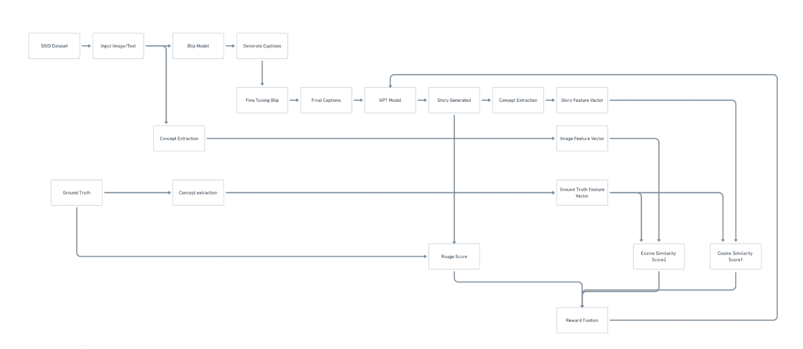

# Reinforcement-Learning-Enhanced-Visual-Storytelling

## Project By

- **Sachin Prasanna** (211IT058)  
- **Subhojit Karmakar** (211IT071)  
- **Abhayjit Singh Gulati** (211IT085)  


## Problem Statement
The Visual Storytelling Task (VST) focuses on transforming a sequence of images into coherent and contextually relevant textual narratives. The challenge is to generate a story that not only describes each image but also effectively captures the underlying connections between them, forming a unified and engaging narrative.


## Dataset

For this project, we employ the **Sequential Storytelling Image Dataset (SSID)**, introduced by Z. M. Malakan et al. in their work on Visual Storytelling [12]. The dataset is a collection of open-source video frames paired with story-like annotations. 

### Key Features of the Dataset:
- Each sequence in SSID consists of **five images**, with **four distinct story annotations** provided per sequence.  
- The images were manually selected from publicly available videos across **three domains**:
  - Documentaries
  - Lifestyle
  - Movies
- The images were annotated by human contributors via **Amazon Mechanical Turk**.

### Dataset Summary:
- Total Images: **17,365**
- Unique Sequences: **3,473** (each consisting of five images)
- Ground-Truth Stories: **13,892 unique narrative annotations**
- Each story consists of **five sequentially connected sentences** to form a coherent narrative.

### Annotation Format:
The dataset annotations are structured as follows:

```json
"annotations": [
    {
        "storylet_id": 5947,
        "storytext": "Inside the car with his family he talks with enthusiasm.",
        "youtube_image_id": "2036",
        "album_id": 10891,
        "story_id": 5947,
        "image_order": 1
    }
]
```


## Dataset Structure after Organising

The dataset followed a hierarchical structure after organising and restructring, which was what was used in our endevours:

- **Album_id1**  
  - **Story_id1**  
    - `Image_id1`: `<Image Data>`  
    - `storytext1`: `<Story Text>`  
    - `image_order`: `<Order of the Image>`  
    - ...  
  - **Story_id2**  
    - `<Similar structure as Story_id1>`  
    - ...  

- **Album_id2**  
  - `<Similar structure as Album_id1>`  
  - ...


## Methodology

The overall methodology can be seen below:


### Making captions from images
The first step in our methodology is generating captions for images using the BLIP (Bootstrapped Language-Image Pre-training) model, a pre-trained language-image model by Salesforce. We begin by loading and processing images through the BLIP processor, which converts them to RGB format, creates input tensors, and passes these tensors to the BLIP model to generate captions. These captions are decoded to provide an initial textual description of the images. To improve performance on our specific dataset, SSID, we fine-tune the BLIP model. A custom PyTorch dataset class is created to handle image-caption pairs, converting them into tensors for training. This fine-tuning is performed over multiple epochs, using a DataLoader to batch the data and an AdamW optimizer for parameter updates. During each iteration, the model calculates loss, backpropagates gradients, and updates parameters, enhancing its performance on the SSID dataset. The fine-tuned model is then used to generate captions for test images, expected to be more accurate and contextually relevant to the test set.




### Building a reward function

#### Converting the image to feature vectors

We generate a unified concept vector for a set of images using a two-stage approach with the BLIP and CLIP models. First, BLIP creates captions that summarize each image’s visual content. These captions are then encoded into high-dimensional vectors by CLIP, capturing the semantic essence of each image. By averaging these vectors, we produce a single feature vector that encapsulates the common themes and attributes across the image set, facilitating further analysis and applications.

#### Converting the story to feature vectors

This process generates a unified feature vector for narrative text by identifying and encoding its key concepts. Using RAKE for keyword extraction and CLIP for feature encoding, we extract meaningful keywords from the story text. Each keyword is then converted into a feature vector by CLIP, capturing its semantic meaning. Finally, these vectors are averaged to form a single, comprehensive representation of the story's main content.

#### Converting the ground truth to feature vectors

This process generates a unified feature vector for the ground-truth text by identifying and encoding its key concepts. Using RAKE for keyword extraction and CLIP for feature encoding, we extract meaningful keywords from the ground-truth text. Each keyword is then converted into a feature vector by CLIP, capturing its semantic meaning. Finally, these vectors are averaged to form a single, comprehensive representation of the ground-truth text's main content.

#### Calculating the three scores

we calculate three key metrics for reinforcement learning evaluation by assessing the similarity between generated narratives, ground-truth descriptions, and image content.

Cosine Similarity: We calculate two cosine similarity scores to measure semantic alignment. The first score compares the feature vector derived from the image set to that of the generated story, while the second score compares the ground-truth text to the generated story. Both scores are computed by transforming the texts and images into high-dimensional feature vectors using CLIP, normalizing them, and finding the cosine of the angle between the vectors to determine similarity.

ROUGE Score: Using ROUGE metrics, we evaluate textual overlap between the generated story and the combined ground-truth captions. We calculate ROUGE-1 (unigram), ROUGE-2 (bigram), and ROUGE-L (longest common subsequence) scores, which capture how much of the ground-truth information is reflected in the generated story.

These scores collectively provide feedback on the topic consistency, semantic alignment, and coverage of the generated narratives, supporting the reinforcement learning model in generating more coherent and accurate stories.

To evaluate caption quality and narrative consistency, we define a reward function by extracting and comparing topics from images and corresponding stories. Our approach uses a two-stage process, leveraging the BLIP and CLIP models to represent and encode visual data as text. First, BLIP generates captions for each image, summarizing its visual content. These captions are then encoded into feature vectors using CLIP, resulting in a unified concept vector that captures the common themes across all images. This representation enables efficient semantic analysis for multiple images.

Next, we extract topics from narrative text, representing them as feature vectors. We use RAKE for keyword extraction and CLIP for encoding. RAKE identifies important phrases in the narrative, highlighting essential themes without domain-specific bias. Each keyword is encoded by CLIP, and these vectors are averaged to produce a feature vector that represents the main content of the story.

### Reward Functions for Topic Consistency

For a given sequence of images and their generated story, we define topic vectors: topic_v for visual content and topic_l for language content. Using RAKE, we extract topic information topic_c for the generated story. Three reward functions for topic consistency are defined as follows: r_bleu (the sentence-BLEU score between the generated story and the ground-truth story), r_topic_cv (the cosine similarity between topic_c and topic_v), and r_topic_cl (the cosine similarity between topic_c and topic_l).

The total reward function is:

r=λ⋅r_bleu+γ⋅r_topic_cv+η⋅r_topic_cl

where lambda, gamma, and eta are hyper-parameters controlling the weights of each reward component. This reward function aims to optimize both the narrative coherence and alignment of visual and language content in generated stories.


## Results
After running the model you will get the final story which is then evaluated against the ground truth. We compute some scores such as Rouge score, Meteor score.


| Model                     | Rouge 1 | Rouge 2 | Rouge L | Meteor |
|---------------------------|---------|---------|---------|--------|
| Seq2Seq + attn. Baseline | 0.35    | 0.11    | 0.28    | 0.12   |
| Pointer Generator         | 0.36    | 0.12    | 0.33    | 0.15   |
| Lead 3 Baseline           | 0.40    | 0.17    | 0.36    | 0.20   |
| **Our Model**             | **0.26** | **0.12** | **0.21** | **0.26** |


